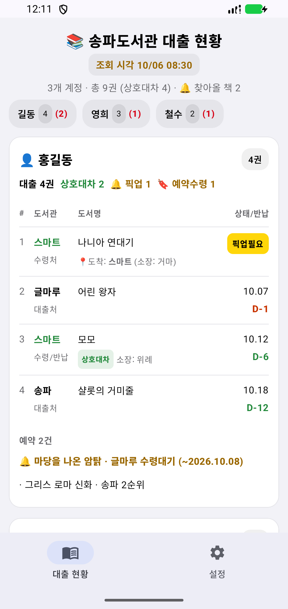
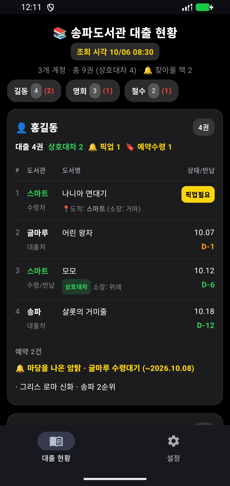
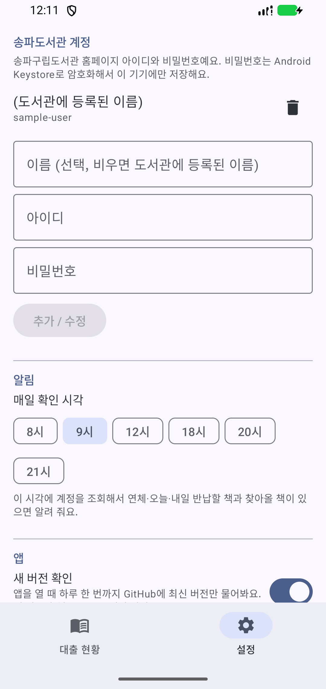

# 반납요정 (Return Fairy)

송파구립도서관(splib.or.kr) 대출 현황을 한 화면에 보여 주는 Android 앱입니다. 가족처럼 여러 계정을 넣어 두면
계정마다 빌린 책·상호대차·예약을 카드로 보여 주고, 반납일이 다가오거나 찾아올 책이 생기면 알림을 보냅니다.
**송파구립도서관 계정이 있어야 쓸 수 있습니다.** 한국어/영어를 지원합니다.

An Android app that shows loans, interlibrary requests and reservations for one or more Songpa Public Library
(Seoul) accounts on one screen, with due-date and pickup reminders. Requires a splib.or.kr account.

<p>
  
  
  
</p>

> 스크린샷은 예시 데이터로 만든 화면입니다.

## 설치

구글 플레이에는 올라가 있지 않고, GitHub에서 APK 파일을 받아 설치합니다.

1. 휴대폰에서 [최신 릴리스](https://github.com/pchuri/return-fairy/releases/latest)를 열고 `return-fairy-<버전>.apk`를 내려받습니다.
2. 내려받은 파일을 엽니다. "출처를 알 수 없는 앱" 설치를 묻는 화면이 나오면 사용하는 브라우저(또는 내 파일 앱)에 허용해 줍니다.
3. 설치가 끝나면 허용했던 "출처를 알 수 없는 앱" 설정은 다시 꺼 두어도 됩니다.

- **업데이트**: 앱을 열 때 하루 한 번까지 새 버전이 있는지 확인해서 알려 줍니다(설정 → 앱 → 새 버전 확인에서 끌 수 있음).
  새 APK를 내려받아 같은 방법으로 설치하면 계정·설정은 그대로 남고 덮어써집니다.
- **진짜 파일인지 확인하기(선택)**: 모든 릴리스 APK는 같은 키로 서명되어 있습니다. 서명 인증서 SHA-256은
  `0d5c7dd151cc81c4b38cbcee68d4e2c59005dd6581fd2c39036bd9941b5dd272` 입니다. 릴리스마다 APK 파일의 SHA-256(`.sha256`)도 함께 올립니다.

## 주요 기능

- 📚 **한 화면 대출 현황**: 계정 탭에 `대출권수 (상호대차)`, 카드마다 픽업필요 → 반납 임박순 → 이동중 순서
- 🔁 **상호대차(책솔이)**: 수령·반납 도서관, 책을 보낸 도서관, 진행 상태(입수·발송·요청중·신청중)
- 🔖 **예약**: 대기 순번, 도착한 예약은 수령 마감일과 함께 강조
- 🔔 **매일 알림**: 정한 시각에 조회해서 연체·오늘·내일 반납할 책과 찾아올 책(상호대차 도착·예약 도착)을 알림
- 🔄 **당겨서 새로고침**, 마지막 조회 결과를 저장해 두어 앱을 열면 바로 보이고 인터넷이 안 될 때도 확인 가능
- 🌓 휴대폰 설정에 따라 라이트/다크, 🌐 한국어/영어

같은 화면을 PC·아이폰·터미널에서 보는 도구는 [songpa-loan-tracker](https://github.com/pchuri/songpa-loan-tracker)에 있습니다.
권수 기준과 화면 구성이 같습니다.

## 개인정보

도서관 조회는 휴대폰이 송파구립도서관 사이트에 직접 접속해서 하고, 조회 결과와 계정은 휴대폰 안에만 저장합니다. 개발자에게 전송되는 정보는 없습니다.
도서관 비밀번호는 Android Keystore로 암호화합니다.
자세한 내용은 [개인정보처리방침](PRIVACY_POLICY.md)을 참고하세요.

## 3.x에서 올리는 경우

4.0부터 직접 책 등록·사진 인식·AI 기능을 없애고 송파구립도서관 계정 전용으로 바꿨습니다. 3.x에서 직접 등록한 책 기록은
4.0으로 업데이트할 때 지워집니다. 도서관 계정은 그대로 남습니다.

---

# 개발자용

## 기술 스택

- Kotlin + Jetpack Compose (Material 3)
- OkHttp + Jsoup (송파구립도서관 스크래핑, songpa-loan-tracker `songpa_core/`를 Kotlin으로 옮김)
- WorkManager (매일 조회·알림)
- Android Keystore (계정 비밀번호 암호화)
- minSdk 26 / targetSdk 35

## 프로젝트 구조

```
app/src/main/java/com/pchuri/returnfairy/
├── core/          # 로그인·목록 파싱·계정별 결과 조립 — songpa_core/와 맞춰 유지
├── data/          # AccountStore(Keystore 암호화 계정), SettingsStore, SnapshotStore(마지막 조회 결과)
├── notify/        # 매일 조회 WorkManager, 알림 내용(DailyDigest)
├── update/        # GitHub Releases 새 버전 확인
└── ui/            # Compose UI (대출 현황 / 설정 탭)
```

도서관 사이트가 바뀌면 이 앱의 `core/`와 songpa-loan-tracker의 `songpa_core/`, `scriptable/songpa-loan-tracker.js`를 함께 고칩니다.

## 빌드·테스트

```bash
export JAVA_HOME="/Applications/Android Studio.app/Contents/jbr/Contents/Home"   # macOS 예시
./gradlew testDebugUnitTest assembleDebug
```

- 일시적인 연결 실패는 계정별로 마지막 성공 결과를 유지하며, 화면에 그 시각과 이전 결과임을 표시합니다.
  로그인·세션·페이지 오류는 이전 결과로 숨기지 않습니다.
- 매일 조회에서 연결 실패가 있으면 WorkManager가 15분부터 지수 백오프로 최대 3회 재시도합니다
  (15·30·60분, 실제 실행 시각은 Android의 네트워크·절전 제약에 따라 늦어질 수 있음).
  재시도 중에는 알림을 미루고, 복구되거나 재시도를 소진한 마지막 조회의 성공 계정만 알립니다.
  저장된 이전 결과로 알리지 않으며, 같은 재시도 과정에서 성공 계정의 알림을 반복하지 않습니다.
  재시도가 끝나면 다음 조회는 설정한 현지 시각으로 다시 맞춥니다. 예를 들어 오전 9시 조회가
  10시 45분에 끝나도 다음 날은 오전 9시로 예약합니다(실제 실행은 Android 제약으로 늦어질 수 있음).

- `LiveFetchTest`: 실제 계정으로 조회를 확인합니다.
  (`RETURNFAIRY_TEST_USERID`/`RETURNFAIRY_TEST_PASSWORD`를 줄 때만 실행. 도서관이 클라우드 IP를 막아 CI에서는 건너뜁니다)

## 릴리스

1. `app/build.gradle.kts`의 `versionCode`를 올리고 `versionName`을 바꿉니다 (예: `4.0.1`).
2. `main`에 반영한 뒤 같은 이름의 태그를 푸시합니다: `git tag v4.0.1 && git push origin v4.0.1`
3. GitHub Actions가 서명된 APK를 만들고, 서명 인증서가 위 SHA-256과 같은지 확인한 뒤 릴리스에 올립니다.
   앱의 새 버전 확인은 이 릴리스의 태그를 봅니다.

서명에 필요한 Actions 시크릿: `SIGNING_KEYSTORE_BASE64`(키스토어 파일 base64), `SIGNING_STORE_PASSWORD`,
`SIGNING_KEY_ALIAS`, `SIGNING_KEY_PASSWORD`. 로컬에서 서명하려면 루트에 `keystore.properties`
(`storeFile`, `storePassword`, `keyAlias`, `keyPassword`, 커밋 금지)를 두고 `./gradlew assembleRelease`를 실행합니다.
서명 키를 잃어버리면 기존 설치본을 업데이트할 수 없으니 따로 백업해 두세요.

## 라이선스

MIT. [LICENSE](LICENSE) 참고.
