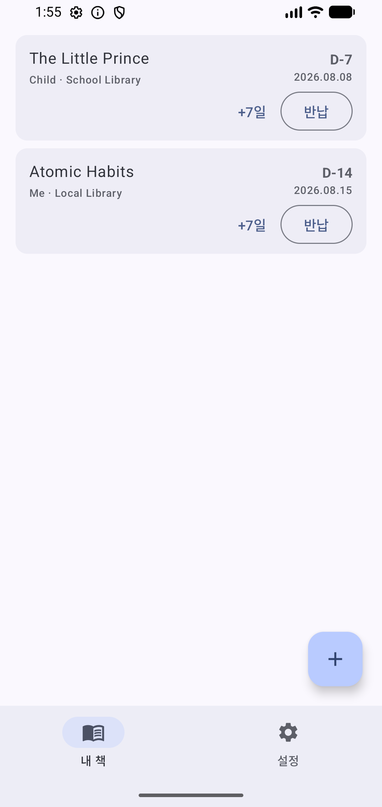
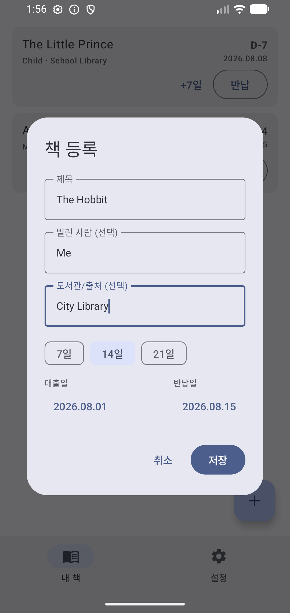
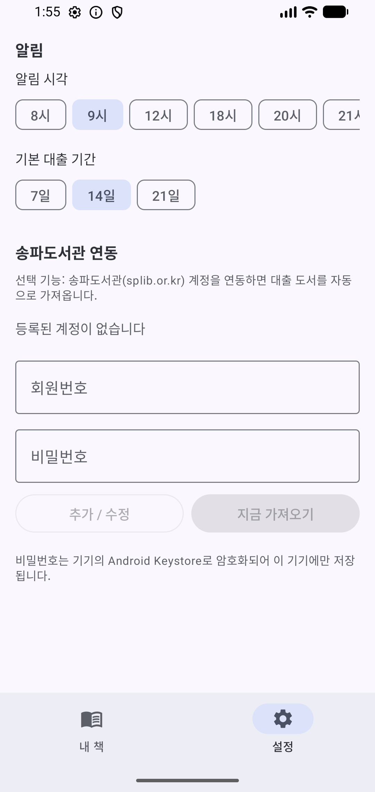

# 반납요정 (Return Fairy)

빌린 책의 반납일을 관리하는 Android 앱입니다. 책을 등록하면 반납 전날과 당일에 알림을 보내 주고,
송파구립도서관(splib.or.kr) 계정을 연동하면 대출 도서를 자동으로 가져옵니다. 한국어/영어를 지원합니다.

A return-date reminder app for borrowed books. Log a book in seconds and get notified before it is due.
Optional Songpa Public Library (Seoul) sync imports loans automatically. Korean/English supported.

<p>
  
  
  
</p>

> 스크린샷은 예시 데이터로 만든 화면입니다.

## 설치

구글 플레이에는 올라가 있지 않고, GitHub에서 APK 파일을 받아 설치합니다.

1. 휴대폰에서 [최신 릴리스](https://github.com/pchuri/return-fairy/releases/latest)를 열고 `return-fairy-<버전>.apk`를 내려받습니다.
2. 내려받은 파일을 엽니다. "출처를 알 수 없는 앱" 설치를 묻는 화면이 나오면 사용하는 브라우저(또는 내 파일 앱)에 허용해 줍니다.
3. 설치가 끝나면 허용했던 "출처를 알 수 없는 앱" 설정은 다시 꺼 두어도 됩니다.

- **업데이트**: 앱을 열 때 하루 한 번까지 새 버전이 있는지 확인해서 알려 줍니다(설정 → 앱 → 새 버전 확인에서 끌 수 있음).
  새 APK를 내려받아 같은 방법으로 설치하면 기록은 그대로 남고 덮어써집니다.
- **진짜 파일인지 확인하기(선택)**: 모든 릴리스 APK는 같은 키로 서명되어 있습니다. 서명 인증서 SHA-256은
  `0d5c7dd151cc81c4b38cbcee68d4e2c59005dd6581fd2c39036bd9941b5dd272` 입니다. 릴리스마다 APK 파일의 SHA-256(`.sha256`)도 함께 올립니다.

## 주요 기능

- 📚 **간편 등록**: 제목 + 대출 기간 프리셋(7/14/21일) 탭 한 번
- 📷 **사진으로 등록**: 대출 영수증·책 표지를 찍으면 제목과 반납일을 읽어 옵니다 (기기 안에서 처리)
- 🗓️ **자연어 반납일**: `5일 후`, `다음 주 금요일`, `이번 달 마지막 평일`, `in 2 weeks`처럼 입력하면 바로 해석합니다.
  규칙으로 인식되지 않는 표현만 설치된 온디바이스 AI(실험실 기능)로 보완합니다.
- 🔔 **반납 알림**: 반납 전날/당일, 원하는 시각에 알림 (연체 포함)
- 🏷️ **빌린 사람 태그**: 가족 등 빌린 사람별로 책 구분
- ✅ **반납 처리·연장**: 직접 등록한 책은 반납 완료 체크, +7일 연장. 반납한 책은 기록으로 남습니다.
- 🔗 **송파구립도서관 연동 (선택)**: 여러 계정의 대출 도서를 자동으로 가져오고 갱신합니다.
  연동한 책의 반납·연장은 도서관 사이트에서 처리합니다.
- 🌓 다크 모드, 🌐 한국어/영어

## 개인정보

모든 기록은 휴대폰 안에만 저장되고 개발자에게 전송되지 않습니다. 도서관 비밀번호는 Android Keystore로 암호화합니다.
자세한 내용은 [개인정보처리방침](PRIVACY_POLICY.md)을 참고하세요.

## 관련 프로젝트

PC·아이폰·터미널에서 송파구립도서관 대출 현황을 보는 도구는
[songpa-loan-tracker](https://github.com/pchuri/songpa-loan-tracker)에 있습니다. 이 앱의 도서관 연동 코드는 그 리포의 `core/` 파서를 Kotlin으로 옮긴 것입니다.

---

# 개발자용

## 기술 스택

- Kotlin + Jetpack Compose (Material 3)
- Room (로컬 DB) + WorkManager (일일 알림)
- OkHttp + Jsoup (송파구립도서관 스크래핑)
- ML Kit 한국어 문자 인식, LiteRT-LM(실험실 AI 모델)
- Android Keystore (계정 비밀번호 암호화)
- minSdk 26 / targetSdk 35

## 프로젝트 구조

```
app/src/main/java/com/pchuri/returnfairy/
├── core/          # 송파구립도서관 로그인/파싱 — songpa-loan-tracker core/와 맞춰 유지
├── data/
│   ├── db/               # Room: BookEntry, BookDao, AppDatabase
│   ├── BookRepository.kt # 책 CRUD + 도서관 연동 병합(syncFromSplib)
│   ├── AccountStore.kt   # Keystore 암호화 계정 저장소
│   └── SettingsStore.kt  # 알림 시각, 기본 대출 기간, 업데이트 확인
├── notify/        # 알림 채널, 일일 리마인더 WorkManager
├── scan/          # 사진 인식(영수증·표지), 자연어 반납일 해석
├── update/        # GitHub Releases 새 버전 확인
└── ui/            # Compose UI (내 책 / 설정 탭)
```

## 빌드·테스트

```bash
export JAVA_HOME="/Applications/Android Studio.app/Contents/jbr/Contents/Home"   # macOS 예시
./gradlew testDebugUnitTest assembleDebug
```

- `ParserVerificationTest`: 실사이트 HTML 픽스처로 파서 결과를 비교합니다.
  (`RETURNFAIRY_FIXTURE_DIR` 환경변수를 줄 때만 실행. 픽스처에는 개인정보가 있어 커밋하지 않습니다)
- `LiveLoginTest`, `LiveSyncTest`: 실제 계정으로 로그인·동기화를 확인합니다.
  (`RETURNFAIRY_TEST_USERID`/`RETURNFAIRY_TEST_PASSWORD`를 줄 때만 실행. 도서관이 클라우드 IP를 막아 CI에서는 건너뜁니다)

## 릴리스

1. `app/build.gradle.kts`의 `versionCode`를 올리고 `versionName`을 바꿉니다 (예: `3.0.1`).
2. `main`에 반영한 뒤 같은 이름의 태그를 푸시합니다: `git tag v3.0.1 && git push origin v3.0.1`
3. GitHub Actions가 서명된 APK를 만들고, 서명 인증서가 위 SHA-256과 같은지 확인한 뒤 릴리스에 올립니다.
   앱의 새 버전 확인은 이 릴리스의 태그를 봅니다.

서명에 필요한 Actions 시크릿: `SIGNING_KEYSTORE_BASE64`(키스토어 파일 base64), `SIGNING_STORE_PASSWORD`,
`SIGNING_KEY_ALIAS`, `SIGNING_KEY_PASSWORD`. 로컬에서 서명하려면 루트에 `keystore.properties`
(`storeFile`, `storePassword`, `keyAlias`, `keyPassword`, 커밋 금지)를 두고 `./gradlew assembleRelease`를 실행합니다.
서명 키를 잃어버리면 기존 설치본을 업데이트할 수 없으니 따로 백업해 두세요.

## 라이선스

MIT. [LICENSE](LICENSE) 참고.
